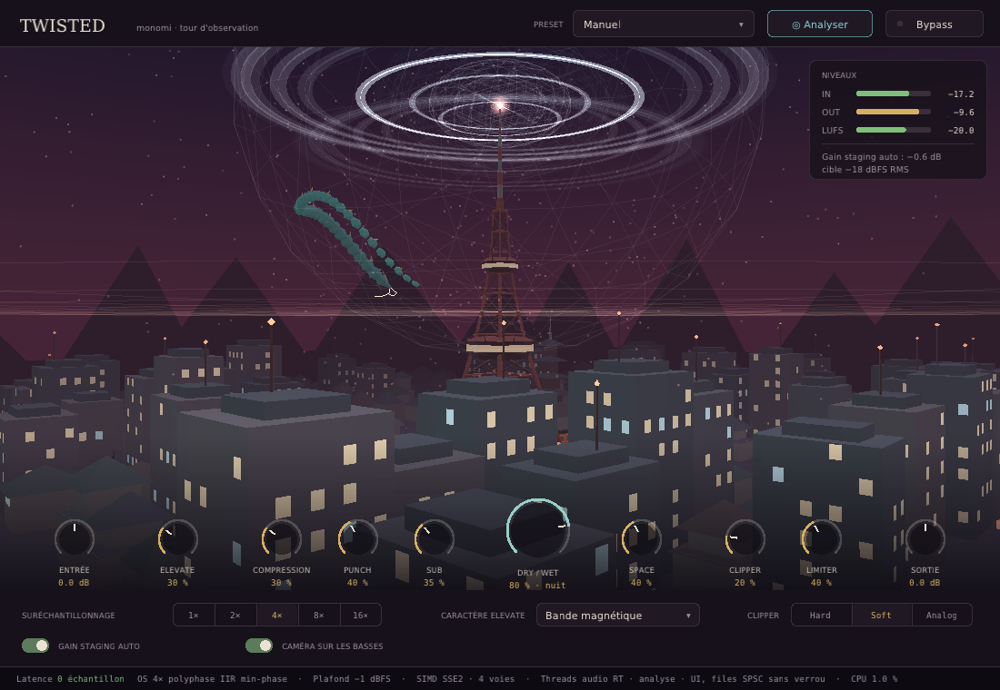

# Twisted · 物見櫓

Plugin de mixage CLAP + VST3 pour Windows et macOS. Il reconnaît la source audio
(kick, basse, voix, bus batterie, guitare/synthé, master) et choisit le réglage
adapté. L'interface est une tour d'observation japonaise en 3D dont chaque knob
change la scène.



Tout est écrit à la main : pas de JUCE, pas d'iPlug, pas de framework d'interface.
Le build ne demande que **CMake** et un compilateur C++17. CMake télécharge tout seul
trois dépendances d'en-têtes, toutes sous licence libre :

| Dépendance | Rôle | Licence |
|---|---|---|
| [CLAP](https://github.com/free-audio/clap) | en-têtes C du format CLAP | MIT |
| [vst3_pluginterfaces](https://github.com/steinbergmedia/vst3_pluginterfaces) | en-têtes d'interfaces VST3 (pas le SDK complet) | MIT |
| [stb_truetype](https://github.com/nothings/stb) | dessin du texte avec les polices du système | domaine public / MIT |

## Compiler sous Windows

Prérequis : **Visual Studio 2022**, avec la charge de travail « Développement Desktop
en C++ ». Elle installe aussi CMake et Git.

Dans « Developer PowerShell for VS 2022 » :

```powershell
git clone https://github.com/mtheo54/Twisted.git
cd Twisted
cmake -S . -B build -G "Visual Studio 17 2022" -A x64
cmake --build build --config Release
```

Résultat dans `build\plugins\` :

- `Twisted.clap`
- `Twisted.vst3\` (un dossier, à copier en entier)

Installation, depuis un terminal lancé en administrateur :

```powershell
cmake --install build --config Release --prefix "C:/Program Files/Common Files"
```

La commande copie `Twisted.clap` dans `C:\Program Files\Common Files\CLAP\` et
`Twisted.vst3` dans `C:\Program Files\Common Files\VST3\`. Tu peux aussi faire ces
deux copies à la main.

Dans **FL Studio** : *Options → Manage plugins → Find installed plugins*, puis
cherche « Twisted ». FL Studio lit le VST3 et, dans ses versions récentes, le CLAP.

## Compiler sous macOS

Prérequis : les outils de ligne de commande Xcode (`xcode-select --install`) et CMake
(`brew install cmake`).

```bash
git clone https://github.com/mtheo54/Twisted.git
cd Twisted
cmake -S . -B build -DCMAKE_BUILD_TYPE=Release "-DCMAKE_OSX_ARCHITECTURES=arm64;x86_64"
cmake --build build --parallel
cmake --install build --prefix ~/Library/Audio/Plug-Ins
```

L'installation place `Twisted.clap` dans `~/Library/Audio/Plug-Ins/CLAP/` et
`Twisted.vst3` dans `~/Library/Audio/Plug-Ins/VST3/`. Le build est universel
(Apple Silicon + Intel).

Si tu récupères des binaires compilés ailleurs, par exemple par la CI GitHub, macOS
les met en quarantaine. Pour les débloquer :
`xattr -dr com.apple.quarantine ~/Library/Audio/Plug-Ins/VST3/Twisted.vst3`.

## Options CMake

| Option | Défaut | Effet |
|---|---|---|
| `TWISTED_BUILD_CLAP` | ON | plugin CLAP |
| `TWISTED_BUILD_VST3` | ON | plugin VST3 |
| `TWISTED_BUILD_PREVIEW` | ON | appli `TwistedPreview` : l'interface sans DAW, avec un groove de test qui passe dans le vrai moteur (sans sortie son) |
| `TWISTED_BUILD_TESTS` | ON | tests DSP (`ctest --test-dir build -C Release`) |
| `TWISTED_ENABLE_AVX2` | OFF | compile pour AVX2. Off = SSE2, qui tourne sur tous les PC x86-64 |

## Ce que fait le plugin

Chaîne audio, sans latence (0 échantillon rapporté à l'hôte) :

```
Entrée (+ gain staging auto, cible −18 dBFS RMS)
 → Sub → Punch (transient shaper) → Compression          fréquence d'origine
 → Elevate : saturation (4 caractères) + excitateur       suréchantillonné 1× à 16×
 → Space : largeur M/S (graves gardés mono) + ambiance
 → Dry/Wet
 → Clipper Hard / Soft / Analog                           suréchantillonné
 → Limiter sans look-ahead, plafond −1 dBFS → Sortie → bypass sans clic
```

- **Suréchantillonnage sans latence** : filtres demi-bande IIR polyphasés à phase
  minimale, avec 2 à 4 étages en cascade. Les tests mesurent 128 dB de réjection.
- **SIMD** : les deux voies stéréo et les deux branches polyphasées passent dans un
  seul registre de 4 floats (SSE2 sur x86-64, NEON sur Apple Silicon).
- **Threads sans blocage** : le thread audio ne prend jamais de verrou et n'alloue
  jamais. Il pousse le signal dans une file SPSC lock-free vers un thread d'analyse,
  qui calcule les coups de basse, le gain staging et la reconnaissance. L'interface
  lit des atomiques et une seconde file SPSC.
- **Reconnaissance** : le bouton *Analyser* écoute 2 s, classe la source et applique
  le preset (les knobs glissent vers leurs nouvelles valeurs).

Interface : OpenGL 3.2 natif (Win32/WGL, Cocoa/NSOpenGL, X11/GLX). C'est le portage
C++ de la maquette `ui-prototype/`. Le détail des effets de chaque knob est dans
[`docs/UI_SPEC.md`](docs/UI_SPEC.md).

## Ce qui a été vérifié, et les limites

- **Vérifié** :
  - compilation Linux (GCC) et Windows (MinGW, en compilation croisée) sans
    avertissement ;
  - tests DSP au vert : réponse des filtres, absence de NaN, plafond respecté,
    bypass exact, détection des basses, reconnaissance ;
  - les deux plugins chargés dans un hôte de test minimal (audio, paramètres,
    automation, sauvegarde et rechargement de l'état, ouverture de l'interface) ;
  - rendu de l'interface vérifié par capture d'écran sous Linux.
- **Pas encore testé sur une vraie machine Windows ou Mac, ni dans FL Studio.** Le
  code macOS (Cocoa) n'a pas pu être compilé ici. La CI GitHub
  (`.github/workflows/build.yml`) le compile sur macOS, Windows (MSVC) et Linux à
  chaque push.
- La reconnaissance utilise pour l'instant une heuristique spectrale
  (bandes graves/médiums/aigus, transitoires), pas encore un modèle entraîné.
- Le limiteur mesure la crête échantillon (plafond −1 dBFS), pas le true peak.
  Le clipper suréchantillonné, juste avant, réduit les dépassements entre
  échantillons.
- OpenGL est déprécié par Apple mais toujours fourni, y compris sur Apple Silicon.
- Sous Linux, l'interface tourne dans son propre thread : elle sert aux tests, Linux
  n'est pas une cible.
- La fenêtre a une taille fixe (1100 × 760, multipliée par l'échelle de l'écran).

## Arborescence

```
src/core/       paramètres, presets, moteur DSP, suréchantillonneur, analyse, files SPSC
src/ui/         chargeur OpenGL, scène 3D, dessin 2D + texte, éditeur (knobs, menus)
src/platform/   fenêtres natives : Win32, Cocoa, X11
src/clap/       wrapper CLAP
src/vst3/       wrapper VST3 (interfaces Steinberg uniquement)
src/preview/    appli d'aperçu sans DAW
tests/          tests DSP
ui-prototype/   maquette HTML/Three.js validée
docs/           spécification de l'interface
```
